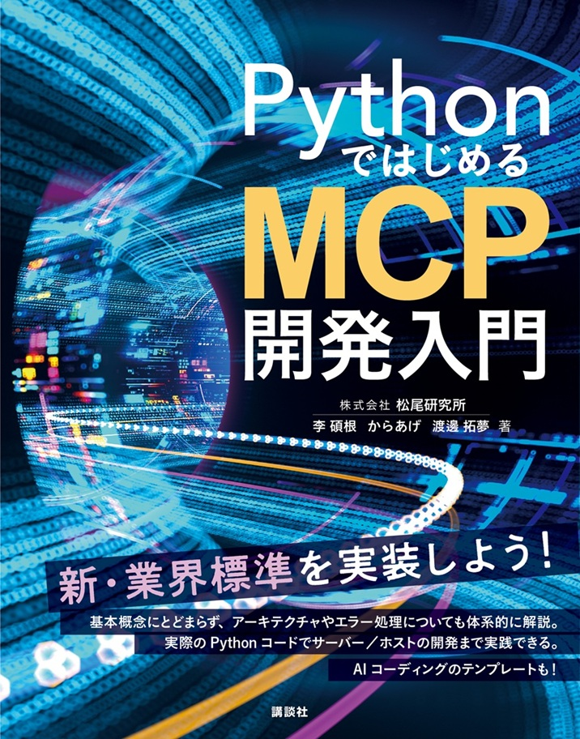

# Pythonで始めるMCP開発入門 - サポートサイト

本リポジトリは書籍「Pythonで始めるMCP開発入門」のサポートサイトです。

購入先は以下となります。

[Amazon](https://amzn.to/4lOGtiM)

## 書籍について

「Pythonで始めるMCP開発入門」は、Model Context Protocol (MCP) を使った開発を学ぶための実践的な入門書です。

## 書籍コンテンツ

第4章、第5章で紹介するMCPサーバー・ホストの実践コードについては下記リポジトリに格納しています。  
https://github.com/suckgeun/book_code

第6章で紹介するテンプレートリポジトリは以下となります。  
https://github.com/karaage0703/python-boilerplate-llm

第6章で紹介したLLMで開発したMCPサーバーの例は以下となります。

https://github.com/karaage0703/mcp-rag-server

https://github.com/karaage0703/notion-mcp-light

## 関連コンテンツ

第4章で紹介したMCPサーバーをAIエージェントで使いやすく改変したMCPサーバー
https://github.com/karaage0703/mcp-web-search

## サポート

**Issues**: 技術的な質問や不具合報告は[Issues](https://github.com/karaage0703/python-mcp-book/issues)へお願いします

## ライセンス

サンプルコードのライセンスは、それぞれのリポジトリのライセンスを確認してください。

このリポジトリ自体は、MITライセンスで提供されています。詳細は[LICENSE](./LICENSE)をご覧ください。

## 貢献

正誤表への追加や改善提案は、プルリクエストまたはIssueでお寄せください。
